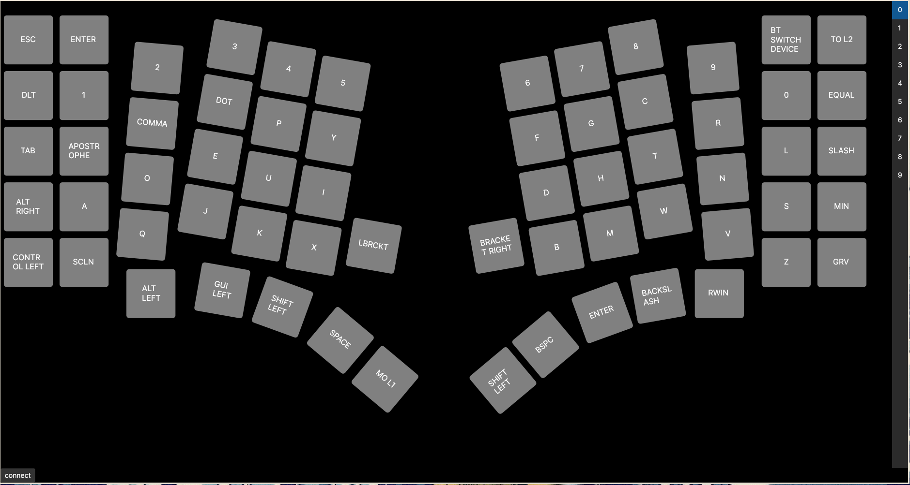

# KaSe_soft – Desktop Configuration Tool for the KaSe Keyboard

KaSe_soft is the desktop configuration and management tool for the **KaSe** custom mechanical keyboard.
It provides a graphical interface to visualize the layout, edit keymaps and layers, and push the configuration
to the keyboard over USB (CDC ACM), working together with the firmware and hardware repositories:

- Firmware (embedded): [`KaSe_Code`](https://github.com/mornepousse/KaSe_Code)
- PCB / hardware / mechanics: [`KaSe_PCB`](https://github.com/mornepousse/KaSe_PCB)



---

## Features

- **Keyboard visualization**
  - Graphical view of the KaSe layout (column-oriented, rotated blocks, special keys).
  - Layout is generated from a `default.json` file that describes the geometry
    of the keyboard (handled by `KeyboardUiRenderer`).

- **Layer management**
  - Read the current keymap from the keyboard.
  - Select the active layer.
  - Display all keys for each layer.

- **Key remapping**
  - Select a key in the UI and assign a new keycode
    (based on the HID enumeration defined in `K_Keys.cs`).
  - Supports a wide set of standard HID keys (letters, digits, modifiers,
    function keys, keypad, etc.).
  - Sends changes to the firmware using a simple text protocol
    over the CDC ACM serial port.

- **Serial communication with the keyboard**
  - Automatic detection of the KaSe keyboard serial port on Linux
    (looks for a device with `ID_MODEL=KaSeV2` via `udevadm`).
  - Open / close the serial port.
  - Request keymaps, switch layers, update individual keys.

- **Cross‑platform UI (Avalonia)**
  - Built with **Avalonia UI**.
  - Target platform for now: Linux (tested with udev‑based detection).
    Other OSes are theoretically possible but may require
    different serial‑port detection logic.

---

## Project structure (overview)

Main files and their roles in the `KaSe Controller` project:

- `App.axaml` / `App.axaml.cs`
  - Avalonia application entry point and global setup.
  - Provides default keymaps (layers) and holds global state such as
    the currently selected layer.

- `MainWindow.axaml` / `MainWindow.axaml.cs`
  - Main window of the application.
  - Contains the main keyboard view area (a grid where the dynamic layout is injected)
    and basic controls like the `connect` button.
  - On load, inserts the rendered keyboard UI using
    `KeyboardUiRenderer.LoadDefaultJsonUi()`.

- `SelectWindow.axaml` / `SelectWindow.axaml.cs`
  - Additional window/control for selecting keys and layers.
  - Binds an `ObservableCollection` of `K_Keys` and uses the converter
    to display human‑readable labels.

- `KeyboardUiRenderer.cs`
  - Loads `default.json`, which describes the physical layout of the keyboard.
  - Dynamically builds Avalonia controls (`Keycap`, `StackPanel`, nested groups, etc.)
    according to the JSON structure (columns, rows, margins, rotations, widths…).

- `Keycap.axaml` / `Keycap.axaml.cs`
  - Custom Avalonia control representing a single key.
  - Binds to a `K_Keys` value and uses `KeyConverter` to generate a text label.

- `KeyConverter.cs`
  - Converts `K_Keys` enumeration values into string labels suitable for the UI
    (e.g. turning `K_Q` into "Q").

- `K_Keys.cs`
  - Large enumeration of HID keycodes.
  - Contains both raw HID codes (e.g. `HID_KEY_Q`) and friendly aliases
    used by the keymap (`K_Q`, `K_1`, `K_LCTRL`, etc.).

- `SerialPortManager.cs`
  - Manages serial ports.
  - Enumerates available ports and checks which one is the KaSe keyboard
    (Linux: `udevadm` + `ID_MODEL=KaSeV2`).
  - Opens/closes the serial port and exposes methods to:
    - get the current keymap for a given layer,
    - change keys,
    - and perform other keyboard‑level commands.

- `default.json`
  - JSON description of the physical layout:
    columns, rows, margins, rotation angles of blocks, special key widths, etc.
  - Used exclusively for rendering the keyboard in the UI; actual key values
    come from the firmware/keymap.

---

## Requirements

- **.NET SDK** 9.0 (or a compatible version as defined in `KaSe Controller.csproj`).
- **Linux** (tested):
  - `udevadm` must be available for automatic port detection.
- A KaSe keyboard built from [`KaSe_PCB`](https://github.com/mornepousse/KaSe_PCB)
  and flashed with the firmware from [`KaSe_Code`](https://github.com/mornepousse/KaSe_Code).

---

## Getting started

### 1. Clone the repository

```bash
git clone https://github.com/mornepousse/KaSe_SOFT.git
cd KaSe_SOFT/"KaSe Controller"
```

### 2. Restore dependencies and build

```bash
dotnet restore
dotnet build
```

### 3. Run the application

```bash
dotnet run
```

On first run, you should see the KaSe layout and a `connect` button at the bottom.

---

## Using KaSe_soft with a real keyboard

1. **Flash the firmware**
   - Follow the instructions from [`KaSe_Code`](https://github.com/mornepousse/KaSe_Code)
     to flash the ESP32‑S3 with the KaSe firmware.
   - After flashing, the device should expose both:
     - a HID keyboard interface, and
     - a CDC ACM serial interface.

2. **Plug the keyboard via USB**
   - On Linux, it typically appears as `/dev/ttyACM*` or `/dev/ttyUSB*`.
   - `SerialPortManager` uses `udevadm` to look for `ID_MODEL=KaSeV2`.

3. **Start KaSe_soft**
   - Run the application as shown above.
   - Click the `connect` button.
   - If the port is found and opened successfully, the app will request
     the current keymap for the active layer.

4. **Inspect and edit layers**
   - Use the UI to switch layers.
   - Click/select a key and choose a new `K_Keys` value.
   - The software sends an update command to the firmware.

5. **Persistent storage**
   - The firmware stores keymaps in NVS / LittleFS (see `KaSe_Code` docs).
   - Once written, keymaps survive power cycles of the keyboard.

---

## Troubleshooting

- **The keyboard is not detected**
  - Check that the firmware from `KaSe_Code` is flashed and running.
  - Confirm that the device appears in `/dev`:

    ```bash
    ls /dev/ttyACM* /dev/ttyUSB* 2>/dev/null
    ```

  - Manually check the udev information, e.g.:

    ```bash
    udevadm info -n /dev/ttyACM0 | grep 'ID_MODEL'
    ```

  - If the model name differs from `KaSeV2`, you might need to
    adjust `SerialPortManager.CheckPort()`.

- **UI shows the layout but no key values**
  - Verify that the serial port really opened when pressing `connect`.
  - Check that the firmware supports the keymap‑query commands used by this tool
    (see the CDC ACM protocol description in `KaSe_Code`).

- **Display or theme issues**
  - The app uses Avalonia with the `FluentTheme`.
    Depending on your environment, different GPU or platform settings
    may help; refer to Avalonia documentation for advanced options.

---

## Relationship with other repositories

- **`KaSe_Code` – Firmware**
  - Implements matrix scanning, layers, persistent keymaps, storage, USB HID,
    BLE HID, OLED display, and the CDC ACM command interface used by KaSe_soft.

- **`KaSe_PCB` – Hardware / PCB / mechanics**
  - KiCad project with schematics, PCB layout, Gerbers and 3D resources.
  - Describes the exact MCU, pinout, physical layout and mechanical constraints.

KaSe_soft is the **desktop side** of this ecosystem: it provides a friendly
way to configure what the firmware will store and execute on the actual hardware.

---

## Project status and contributions

This project is **work in progress**. Internal APIs (including the serial
protocol and parts of the UI) may still evolve.

Contributions are welcome, for example:

- Extending the UI (better key selection, multi‑select, themes).
- Adding advanced layer features (macros, combos, tap‑dance, etc.).
- Improving cross‑platform support (Windows/macOS serial detection, etc.).
- Enhancing error handling and logging.

If you open an issue or pull request, please mention whether your changes
also touch the firmware (`KaSe_Code`) or hardware (`KaSe_PCB`).

### Roadmap (short)

- ✅ Linux support (tested with udev-based serial detection).
- ✅ Windows support (planned; serial-port detection and testing still to do).
- 🚧 macOS support (to be explored once Windows path is stable).
- 🚧 Macros
- 🚧 Rename layers

---

## License

Check the `LICENSE` file in this repository for licensing information.

If you build on this project (software, firmware or hardware),
please keep references to the original KaSe project and its repositories:
`KaSe_SOFT`, `KaSe_Code`, and `KaSe_PCB`.

---

# 🇫🇷 KaSe_soft – Outil de configuration pour le clavier KaSe

KaSe_soft est le logiciel de configuration et de gestion pour le clavier
mécanique custom **KaSe**. Il fournit une interface graphique pour visualiser
la disposition des touches, modifier les keymaps et les couches, puis envoyer
la configuration au clavier via USB (CDC ACM), en s'appuyant sur :

- le firmware embarqué : [`KaSe_Code`](https://github.com/mornepousse/KaSe_Code)
- le hardware / PCB / mécanique : [`KaSe_PCB`](https://github.com/mornepousse/KaSe_PCB)

---

## Fonctionnalités

- **Visualisation du clavier**
  - Vue graphique du layout KaSe (disposition en colonnes, blocs inclinés,
    touches spéciales).
  - Le rendu est généré à partir du fichier `default.json` décrivant la
    géométrie du clavier (géré par `KeyboardUiRenderer`).

- **Gestion des couches (layers)**
  - Lecture de la keymap courante depuis le clavier.
  - Sélection du layer actif.
  - Affichage des touches pour chaque couche.

- **Remapping des touches**
  - Sélection d'une touche dans l'interface puis choix d'un nouveau keycode
    (basé sur l'énumération HID définie dans `K_Keys.cs`).
  - Prise en charge d'un large ensemble de touches HID standard (lettres,
    chiffres, modificateurs, fonctions, keypad, etc.).
  - Envoi des modifications au firmware via un protocole texte simple
    sur le port série CDC ACM.

- **Communication série avec le clavier**
  - Détection automatique du port série du clavier KaSe sous Linux
    (recherche d'un périphérique avec `ID_MODEL=KaSeV2` via `udevadm`).
  - Ouverture / fermeture du port série.
  - Requête de keymaps, changement de layer, mise à jour de touches.

- **Interface multi‑plateforme (Avalonia)**
  - Application basée sur **Avalonia UI**.
  - Plateforme cible actuelle : Linux (testé avec détection via udev).
    D'autres OS sont possibles mais nécessitent une adaptation de la
    détection de port série.

---

## Structure du projet (aperçu)

Fichiers principaux dans le projet `KaSe Controller` :

- `App.axaml` / `App.axaml.cs`
  - Point d'entrée Avalonia et configuration globale.
  - Fournit les keymaps/layers par défaut et stocke l'état global
    (layer courant, etc.).

- `MainWindow.axaml` / `MainWindow.axaml.cs`
  - Fenêtre principale de l'application.
  - Contient la vue principale du clavier (grille dans laquelle est injecté
    le layout dynamique) et des contrôles comme le bouton `connect`.
  - Au chargement, insère l'UI générée par
    `KeyboardUiRenderer.LoadDefaultJsonUi()`.

- `SelectWindow.axaml` / `SelectWindow.axaml.cs`
  - Fenêtre/contrôle supplémentaire pour la sélection de touches et de couches.
  - Lie une `ObservableCollection` de `K_Keys` et utilise le convertisseur
    pour afficher des labels lisibles.

- `KeyboardUiRenderer.cs`
  - Charge `default.json`, qui décrit la disposition physique du clavier.
  - Construit dynamiquement les contrôles Avalonia (`Keycap`, `StackPanel`,
    groupes imbriqués, etc.) en fonction de la structure JSON
    (colonnes, lignes, marges, rotations, largeurs spéciales…).

- `Keycap.axaml` / `Keycap.axaml.cs`
  - Contrôle personnalisé Avalonia représentant une touche.
  - Se lie à une valeur `K_Keys` et utilise `KeyConverter` pour générer
    le texte affiché.

- `KeyConverter.cs`
  - Convertit les valeurs de l'énumération `K_Keys` en labels texte pour l'UI
    (par exemple `K_Q` → "Q").

- `K_Keys.cs`
  - Grande énumération des keycodes HID.
  - Contient à la fois les codes HID bruts (ex. `HID_KEY_Q`) et des alias
    plus conviviaux utilisés dans les keymaps (`K_Q`, `K_1`, `K_LCTRL`, etc.).

- `SerialPortManager.cs`
  - Gère les ports série.
  - Énumère les ports disponibles et détecte celui du clavier KaSe
    (Linux : `udevadm` + `ID_MODEL=KaSeV2`).
  - Ouvre/ferme le port série et expose des méthodes pour :
    - récupérer la keymap d'un layer donné,
    - modifier des touches,
    - envoyer d'autres commandes au clavier.

- `default.json`
  - Description JSON de la disposition physique : colonnes, rangées,
    marges, angles de rotation des blocs, largeurs spéciales, etc.
  - Utilisé uniquement pour le rendu du clavier dans l'UI ; les valeurs
    de touches viennent du firmware / de la keymap.

---

## Prérequis

- **.NET SDK** 9.0 (ou version compatible avec `KaSe Controller.csproj`).
- **Linux** (testé) :
  - `udevadm` doit être disponible pour la détection automatique du port.
- Un clavier KaSe assemblé à partir de
  [`KaSe_PCB`](https://github.com/mornepousse/KaSe_PCB) et flashé avec
  le firmware [`KaSe_Code`](https://github.com/mornepousse/KaSe_Code).

---

## Prise en main

### 1. Cloner le dépôt

```bash
git clone https://github.com/mornepousse/KaSe_SOFT.git
cd KaSe_SOFT/"KaSe Controller"
```

### 2. Restaurer les dépendances et compiler

```bash
dotnet restore
dotnet build
```

### 3. Lancer l'application

```bash
dotnet run
```

Au premier lancement, tu devrais voir le layout KaSe et un bouton `connect`
en bas de la fenêtre.

---

## Utilisation avec un clavier KaSe réel

1. **Flasher le firmware**
   - Suivre la documentation de [`KaSe_Code`](https://github.com/mornepousse/KaSe_Code)
     pour flasher l'ESP32‑S3 avec le firmware KaSe.
   - Une fois flashé, le périphérique expose :
     - une interface HID clavier, et
     - une interface série CDC ACM.

2. **Brancher le clavier en USB**
   - Sous Linux, il apparaît en général comme `/dev/ttyACM*` ou `/dev/ttyUSB*`.
   - `SerialPortManager` utilise `udevadm` pour rechercher `ID_MODEL=KaSeV2`.

3. **Lancer KaSe_soft**
   - Lancer l'application comme indiqué ci‑dessus.
   - Cliquer sur le bouton `connect`.
   - Si le port est trouvé et ouvert correctement, l'application
     demande la keymap du layer actif et l'affiche.

4. **Inspecter et modifier les layers**
   - Utiliser l'interface pour changer de layer.
   - Cliquer/sélectionner une touche puis choisir une nouvelle valeur `K_Keys`.
   - Le logiciel envoie une commande de mise à jour au firmware.

5. **Stockage persistant**
   - Le firmware stocke les keymaps dans NVS / LittleFS (voir `KaSe_Code`).
   - Les keymaps survivent aux redémarrages du clavier.

---

## Dépannage

- **Le clavier n'est pas détecté**
  - Vérifier que le firmware `KaSe_Code` est bien flashé et en cours d'exécution.
  - Vérifier la présence du périphérique dans `/dev` :

    ```bash
    ls /dev/ttyACM* /dev/ttyUSB* 2>/dev/null
    ```

  - Vérifier manuellement les infos udev, par exemple :

    ```bash
    udevadm info -n /dev/ttyACM0 | grep 'ID_MODEL'
    ```

  - Si le nom de modèle est différent de `KaSeV2`, adapter
    `SerialPortManager.CheckPort()`.

- **L'UI affiche le layout mais pas les touches**
  - Vérifier que le port série est bien ouvert après avoir cliqué sur `connect`.
  - Vérifier que le firmware supporte les commandes de lecture de keymap
    utilisées par cet outil (voir la doc du protocole CDC ACM dans `KaSe_Code`).

- **Problèmes d'affichage / thème**
  - L'application utilise Avalonia avec le thème `FluentTheme`.
  - Selon l'environnement, différents réglages GPU/plateforme peuvent aider ;
    se référer à la documentation Avalonia pour les options avancées.

---

## Liens avec les autres dépôts

- **`KaSe_Code` – Firmware**
  - Implémente le scan de matrice, les layers, les keymaps persistants,
    le stockage, l'USB HID, le BLE HID, l'écran OLED et l'interface de
    commandes CDC ACM utilisée par KaSe_soft.

- **`KaSe_PCB` – Hardware / PCB / mécanique**
  - Projet KiCad avec schémas, PCB, Gerbers et ressources 3D.
  - Décrit le MCU exact, le brochage, la disposition physique et les
    contraintes mécaniques.

KaSe_soft est la **partie desktop** de cet écosystème : il fournit un moyen
confortable de configurer ce que le firmware exécutera sur le hardware réel.

---

## État du projet et contributions

Ce projet est **en cours de développement**. Les API internes (protocole série,
parties de l'UI, etc.) peuvent encore évoluer.

Les contributions sont bienvenues, par exemple :

- Amélioration de l'UI (sélection de touches, thèmes, raccourcis).
- Ajout de fonctionnalités avancées pour les layers (macros, combos, etc.).
- Meilleure prise en charge multi‑plateforme (détection série Windows/macOS…).
- Amélioration de la gestion des erreurs et des logs.

Si tu ouvres une issue ou une pull request, indique si tes changements
impactent aussi le firmware (`KaSe_Code`) ou le hardware (`KaSe_PCB`).

---

## Licence

Voir le fichier `LICENSE` de ce dépôt pour les informations de licence.

Si tu réutilises ce projet (logiciel, firmware ou hardware), merci de garder
des références au projet KaSe original et à ses dépôts :
`KaSe_SOFT`, `KaSe_Code` et `KaSe_PCB`.
